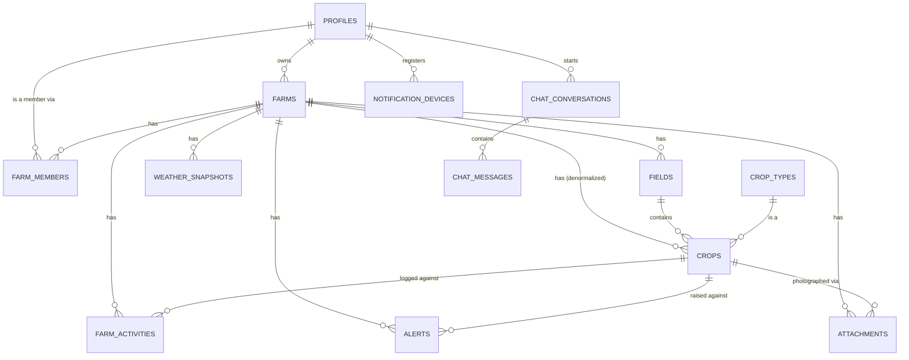

# AgriLite AI — Database Schema (Supabase / PostgreSQL)

Schema for the data the app actually has screens for today — farms, fields,
crops, farm activity logs, weather history, alerts, AI chat, and photo
attachments — plus `profiles` and `farm_members` for auth/multi-user access.
See the design-notes comment block at the top of the migration file for the
reasoning behind each call (enums vs. text, no soft-delete, what was
deliberately left out).

## Scope note — read before wiring this into the backend

The backend today is **stateless** (`backend/docs/PRD.md` §6: "No persistence
layer exists... the client resends full chat history on every `/chat` call").
This schema — specifically `chat_conversations`/`chat_messages` — changes
that. Treat adopting it as a real scope decision (a diff to `PRD.md`, per its
own change-process rule), not an automatic wire-up. Nothing in the FastAPI
backend or the Expo app reads from this schema yet; the frontend's "My Farm",
"Alerts", and "Profile" screens still render `frontend/src/data/mock*.ts`.

## Apply it

**Option A — Supabase Dashboard.** Paste the contents of
[`migrations/20260810120000_init_schema.sql`](migrations/20260810120000_init_schema.sql)
into the SQL Editor of your Supabase project and run it.

**Option B — Supabase CLI** (if you haven't run `supabase init` in this repo
yet, this folder is already laid out the way it expects):

```bash
npx supabase login
npx supabase link --project-ref <your-project-ref>
npx supabase db push
```

## Entity overview



## Tables

| Table | Purpose |
|---|---|
| `profiles` | 1:1 extension of `auth.users`; notification prefs |
| `farms` | Top-level tenant boundary; owner, location, hectares |
| `farm_members` | Per-farm role (owner/manager/worker/viewer) — RLS backbone |
| `fields` | Sub-divisions of a farm |
| `crop_types` | Shared reference table (Maize, Tomatoes, ...), pre-seeded |
| `crops` | A planted crop instance in a field |
| `farm_activities` | Irrigation/spraying/fertilizing/harvest/scouting log |
| `weather_snapshots` | Daily forecast cache per farm — feeds the two views below |
| `alerts` | Weather/pest/disease/harvest notifications |
| `chat_conversations` / `chat_messages` | AI chat history, if/when persisted server-side |
| `attachments` | Photos, backed by the `farm-media` Storage bucket |
| `notification_devices` | Expo push tokens |

Two views compute what the frontend currently mocks, so they don't need to
be denormalized/cached columns that can drift:

- `farm_summary` — total area, field count, active crop count, days active
  (`frontend`'s "My Farm" stats row)
- `farm_monthly_weather_insights` — avg temp/humidity, total rainfall, any
  frost/fungal risk, grouped by month (`frontend`'s "Farm Insights" tiles)

## Row Level Security

Every table has RLS enabled. Access is gated through `farm_members`: two
`SECURITY DEFINER` helper functions, `is_farm_member(farm_id)` (any role) and
`is_farm_editor(farm_id)` (owner/manager/worker, i.e. not `viewer`), back
nearly every policy so adding a new farm-scoped table later is a ~4-line
policy block, not a redesign. `chat_*` and `notification_devices` are private
per-user instead (`user_id = auth.uid()`), not farm-shared.

`weather_snapshots` and `alerts` have no client insert policy — both are
meant to be written by the backend using the `service_role` key (which
bypasses RLS), since they're system/AI-generated, not user-entered.
